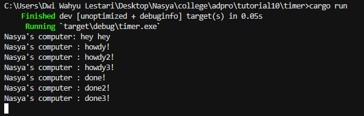

## Reflection

### 1.2

"hey hey" akan tercetak sebelum "howdy!" dan "done!" karena bagian "hey hey" berada di luar fungsi async. Proses eksekusi untuk tetap berlanjut dan mencetak "hey hey" sementara fungsi async masih menunggu hasil dari future-nya.

### 1.3

Penambahan spawner mengakibatkan peningkatan jumlah task yang harus diselesaikan. Spawner yang tidak di-drop menyebabkan program tidak akan pernah berhenti. Hal ini karena program berasumsi bahwa akan selalu ada data yang dikirim oleh spawner

